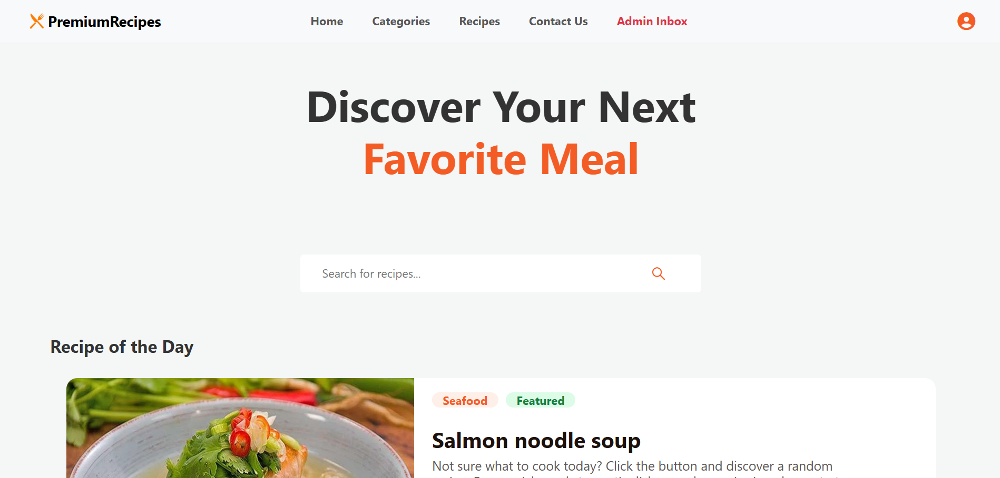
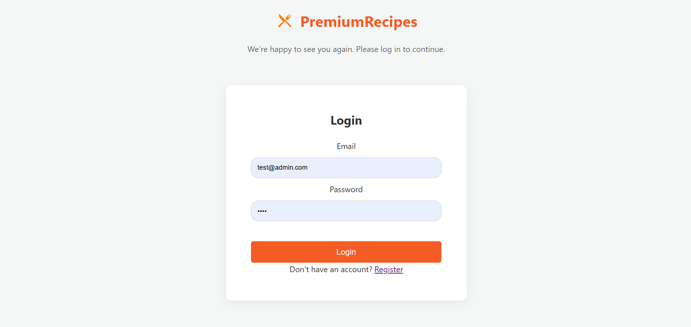
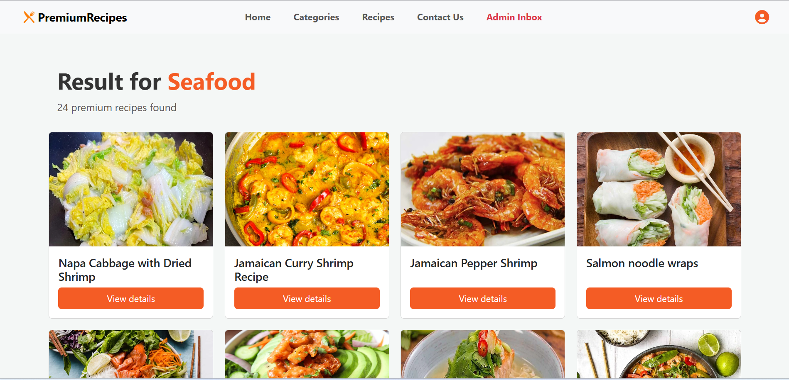

# Interactive Web Application - Recipe Book
**ICT 220 - Phase 3**

## Project Overview
This is a database-driven web application.  
The application features a backend built with PHP and MySQL, incorporating user authentication and a functional contact form.

## Technologies

- We used the MealDB API to retrieve recipes.  
- and we used Bootstrap for designing the user interface of this project.  
- We used Font Awesome to include icons in the project.  
- Most images are in WebP format because it provides better quality with smaller file sizes. This is especially important when the application is deployed online.  
- Most recipes include a YouTube video, but some do not have an associated video.  
- The project was tested on Windows using a WAMP server.  

## Key Features
- **User Authentication:** Secure sign up and login functionality with session management.  
- **Password Security:** All user passwords are encrypted using `password_hash()` for enhanced security.  
- **Contact Form:** Allows users to submit queries which are stored directly in the `messages` database table.  
- **Dynamic Content:** A theme based recipe database linked to user profiles using PHP and MySQL.  

## Folder Structure
The project follows the following structure:  
- `/auth`: Registration (`register.php`), Login (`login.php`), and Logout (`profile.php`) logic.  
- `/includes`: Database connection (`db.php`) and helper functions (`functions.php`).  
- `/css` & `/js`: Frontend styling and client-side validation scripts.  
- `index.php` is the Main application page.  
- `database.sql`: MySQL database export file for project evaluation.  

---

## Setup Instructions (Local Environment)

### 1. Import Database
To set up the database locally using XAMPP or WAMP:  
1. Start **Apache** and **MySQL** via your control panel.  
2. Open **phpMyAdmin** (`http://localhost/phpmyadmin/`).  
3. Create a new database named **`recipe_book`**.  
4. Click the **Import** tab, select the **`database.sql`** file from the project root, and click **Go**.  

### 2. Configure Database Connection
Open `includes/db.php` and update the credentials if they differ from your local setup:

```php
$servername = "localhost";
$username = "root";
$password = "";
$dbname = "recipe_book";
```

### 3. Run the Project

1. Place the project folder inside your server's root directory:  
   - **XAMPP:** `C:\xampp\htdocs\`  
   - **WAMP:** `C:\wamp64\www\`  

2. Open your web browser and navigate to:  
http://localhost/your_project_folder/index.php


## Screenshots

### Homepage


### Login Page


### Categorie Result List page



## Group Members  

**member 1**
- name -W.C.P.Sandaruwan Hapudeniya
- Reg No - ICT/2023/053

**member 2**
- name -Nimesh Udayanga
- Reg No - ICT/2023/011

---


